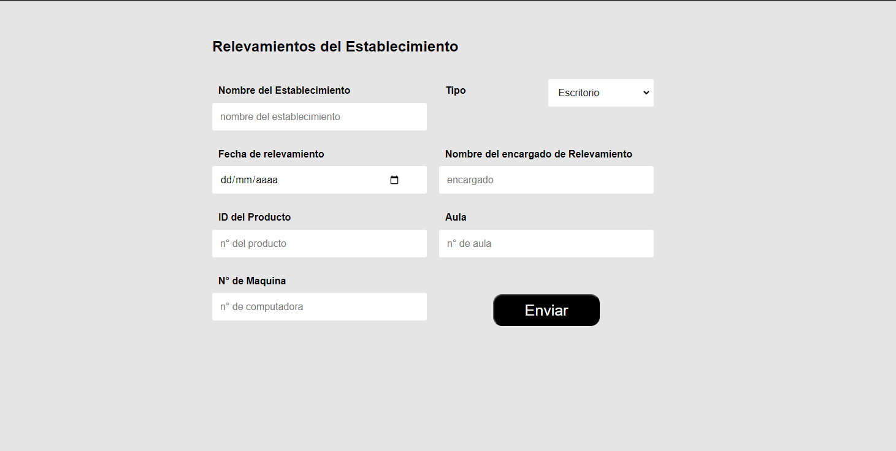
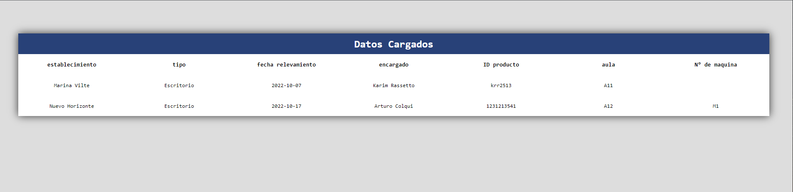
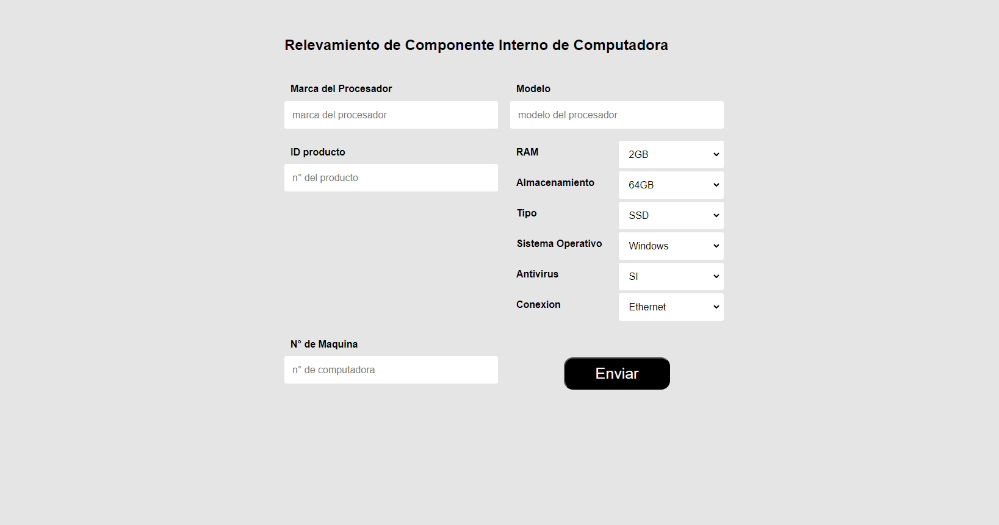
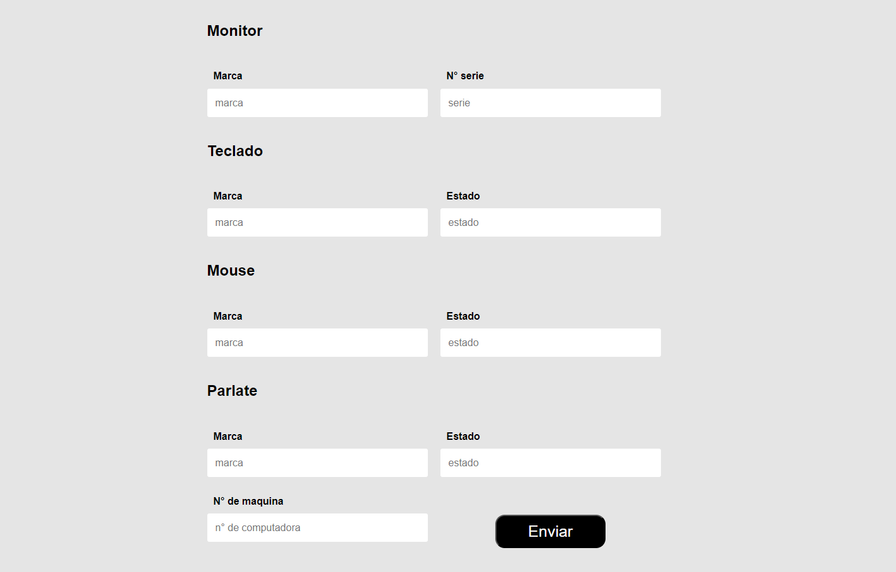

<h1>Proyecto de relevamiento de datos de Instituto Nuevo Horizonte</h1>
<h3>En la materia de Practica Profesionalizante II</h3>
<h3>Tiene implementado el Metodo CRUD</h3>
<h3>Realizado con PHP - XAMPP</h3>

<h3>Inicio de la Pagina</h3>

<h3>Parte de Carga de Datos del Establecimiento</h3>

<h3>Mostrar los datos cargados del Establecimiento</h3>

<h3>Editar los Datos Cargados del Establecimiento</h3>

<h3>Tambien tiene una opcion de Generar Archivo en formato Excel</h3>

<h3>Parte de Carga de Datos de Componente Interno de PC</h3>

<h3>Tambien tiene la opcion de Mostrar los Datos, Actualizar y Generar Archivo en formato Excel</h3>

<h3>Parte de Carga de Datos de Componente Externo de PC</h3>

<h3>Tambien tiene la opcion de Mostrar los Datos, Actualizar y Generar Archivo en formato Excel</h3>
